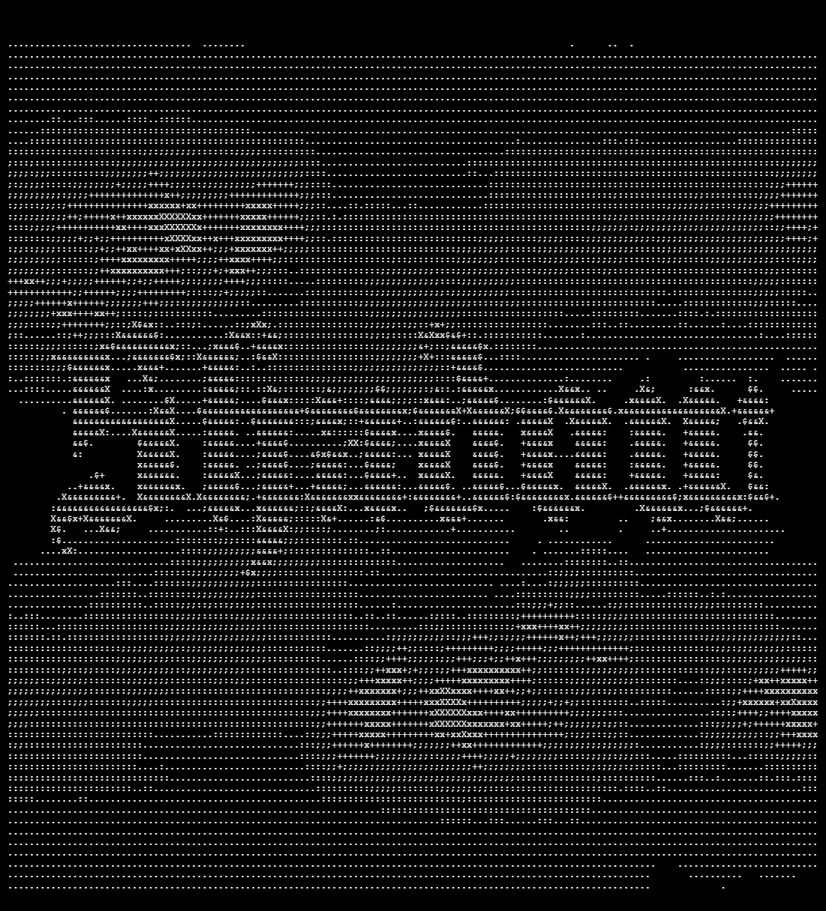

# SHADOW

C2 server of [AETHER](https://github.com/ENIX1701/AETHER) written in Rust. Extended by the [CHARON](https://github.com/ENIX1701/CHARON) TUI to make the experience better.

## Prerequisites

- `Rust` (2024) with `Cargo`
- `Perl`, `Make` and either `gcc`, `clang` or `musl-dev` to build vendored `openssl`

or  

- `Docker` if you want to go the easy route :3

## Run locally

```bash
# clone the project and navigate to the directory
git clone https://github.com/ENIX1701/SHADOW
cd SHADOW

# install dependencies and run via Cargo
cargo run
```

## Deploy

SHADOW is built with native Docker support in mind. A lightweight, multi-stage `Dockerfile` is included to ensure the experience is as smooth as possible.

```bash
# build the image
docker build -t shadow .

# run the container
docker run -d -p 9999:9999 shadow
```

## Environment variables

| Name              | Type      | Default   | Description                           |
|-------------------|-----------|-----------|---------------------------------------|
|`SHADOW_URL`       | `String`  | `0.0.0.0` | IP that SHADOW binds to               |
|`SHADOW_PORT`      | `String`  | `9999`    | Port the SHADOW API is listening on   |

## API guide

For details regarding the API please see the [API reference](docs/API_GUIDE.md).

## Roadmap

- [ ] Log unification
- [ ] Persistent storage

## Legal

> [!IMPORTANT]
> This software is for educational purposes and authorized red team engagements only. The authors are not responsible for misuse.

---

Special thanks to [awesome-readme](https://github.com/matiassingers/awesome-readme) for README ideas and to [readme.so](https://readme.so/) for helping me make this one coherent at all :3
